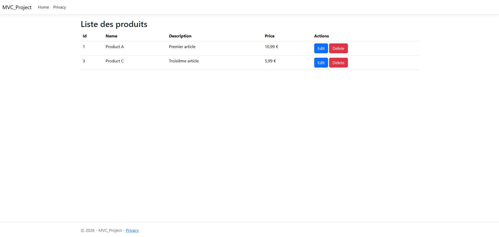

# Inventory Manager — Web Application (ASP.NET Core MVC)

Inventory management web application built with ASP.NET Core MVC.

This application lets you view, edit, and delete products through a Razor interface, with data persisted in a local SQLite database. On first startup, the database is migrated automatically and seeded with sample products.



## Features

* MVC web application (Razor Views)
* Product list with tabular display
* Edit a product (form with server-side validation)
* Delete a product (confirmation page before deletion)
* SQLite persistence via Entity Framework Core
* EF migrations applied automatically on startup
* Demo data (seed) on first launch
* Layered architecture (controller, service/repository, model, data access)
* Responsive Bootstrap 5 UI
* Form validation (Data Annotations + jQuery Unobtrusive)

## Tech Stack

| Component             | Version / Detail   |
| --------------------- | ------------------ |
| .NET                  | 10.0               |
| ASP.NET Core MVC      | —                  |
| Entity Framework Core | 10.0.5             |
| SQLite                | (local file)       |
| Bootstrap             | 5 (local lib)      |
| jQuery + Validation   | —                  |

## Project Structure

```
InventoryManager-ASP/
├── MVC_Project.slnx
└── MVC_Project/
    ├── Controllers/
    │   ├── HomeController.cs          # Home and privacy pages
    │   └── ProductController.cs       # Product CRUD (list, edit, delete)
    ├── Data/
    │   ├── AppDbContext.cs            # EF Core context
    │   ├── DbInitializer.cs         # Initial seed data
    │   └── Migrations/                # SQLite migrations
    ├── Models/
    │   ├── Product.cs                 # Product entity
    │   └── ErrorViewModel.cs
    ├── Services/
    │   ├── IProductRepository.cs      # Data access contract
    │   └── EfProductRepository.cs     # EF Core implementation
    ├── Views/
    │   ├── Product/                   # List, edit, delete views
    │   ├── Home/
    │   └── Shared/                    # Layout, validation scripts
    ├── wwwroot/                       # CSS, JS, Bootstrap, jQuery
    ├── Program.cs                     # Entry point and configuration
    └── appsettings.json               # SQLite connection string
```

## Getting Started

### Prerequisites

* **.NET SDK 10** (installed and available in your `PATH`)

Verify your installation:

```bash
dotnet --version
```

### Installation

```bash
git clone https://github.com/Ev0gs/InventoryManager-ASP.git
cd InventoryManager-ASP
```

### Run the application

From the repository root:

```bash
dotnet run --project MVC_Project
```

**Windows (PowerShell):**

```powershell
dotnet run --project MVC_Project
```

The application starts by default at:

| Protocol | URL                    |
| -------- | ---------------------- |
| HTTP     | http://localhost:5089  |
| HTTPS    | https://localhost:7062   |

The default route points to the product list: `/Product` or `/Product/Index`.

### Build and run in Release mode

```bash
dotnet build MVC_Project/MVC_Project.csproj -c Release
dotnet run --project MVC_Project -c Release --no-build
```

### Verify the application is running

Once started, open in a browser:

```
http://localhost:5089/Product
```

On first launch, three sample products (`Product A`, `Product B`, `Product C`) are created automatically.

## Routes and Actions

Base URL (development): `http://localhost:5089`

| Method | Route                  | Description                        |
| ------ | ---------------------- | ---------------------------------- |
| GET    | `/Product`             | Display all products               |
| GET    | `/Product/Edit/{id}`   | Show the edit form                 |
| POST   | `/Product/Edit/{id}`   | Save changes                       |
| GET    | `/Product/Delete/{id}` | Show the confirmation page         |
| POST   | `/Product/Delete/{id}` | Delete the product                 |
| GET    | `/Home/Privacy`        | Privacy page                       |

> Creating new products through the UI is not implemented yet; initial items come from the seed on first startup.

### `Product` model

| Field         | Type    | Constraints                    |
| ------------- | ------- | ------------------------------ |
| `Id`          | int     | Primary key, auto-generated    |
| `Name`        | string  | Required, max. 100 characters  |
| `Description` | string? | Optional, max. 500 characters  |
| `Price`       | double  | Between 0.01 and 1,000,000     |

Example representation:

```json
{
  "id": 1,
  "name": "Product A",
  "description": "First item",
  "price": 10.99
}
```

## SQLite Database

The connection is defined in `MVC_Project/appsettings.json`:

| Parameter | Value            |
| --------- | ---------------- |
| File      | `MVC_Project.db` |
| Provider  | SQLite (EF Core) |
| Table     | `Products`       |

The `MVC_Project.db` file is created in the application's working directory on first launch. Migrations are applied automatically in `Program.cs` via `Database.MigrateAsync()`.

### Manual migrations (optional)

If you change the model, install the EF tool (once):

```bash
dotnet tool install --global dotnet-ef
```

Then, from the `MVC_Project` folder:

```bash
dotnet ef migrations add MigrationName
dotnet ef database update
```

## Running Tests

No test project is included yet.

## Future Improvements

* Add product creation (`Create` action)
* Authentication and authorization
* REST API for a separate client (Angular, etc.)
* Pagination, search, and filtering on the list
* Categories and stock management
* Docker deployment
* Unit and integration tests

## Author

Pierre Latorse
